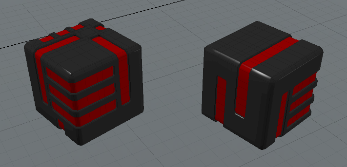

**Introduction**
================

Preface
-------

Back during the release of **diceroll 2.2**, I wanted to learn something new in regards to Python. Even though I was using 2.5.4,
there was still a lot about it that I have never delved into. Sphinx was something I had not really paid any mind to
in the past. It was yet another one of those *need to know only* things about Python. Some things I'd get around to
learning only when I had to, but only if it was part of something else that I had taken an interest in doing.

So somewhere in my discovering of PyMongo, I had been pointed to Sphinx and Jinja. They were both something about document
generation. And since I had just learned about Pandas and CSV, I was in a data retrieval mood still.

In a nutshell,
Sphinx is an EXE (generated during its install from a pip command, which is still magic to me how *it just runs* in
Python 3.9+) that generates documents. Nothing too fancy. Just simple documents that could be read easily/quickly
through any device using any viewer. And when I learned that Sphinx could read Python modules and produce documents
from their ``.__doc__`` strings, I knew I just had to spend a couple days learning how all that stuff happens. 

So basically, my Python dice rolling module has its own operations manual now. And some rabbit holes are
worth their going into.

-Shawn

Requirements
------------

* **Microsoft Windows**
   
   **PyDiceroll** has been tested on Windows versions: 10.
   It has not been tested on MacOS or Linux.
   
* **Python 3.9**
   
   **PyDiceroll** was written using the C implementation of Python
   version 3.9. Also known as CPython. With some doing, this
   module could of course be re-written for Jython, PyPy, or
   IronPython.
   
   Eclipse/PyDev, PyCharm, NetBeans, and IDLE all work fine for
   running this module. One of the easiest to use is Microsoft Visual Studio Code.
   
* **Your Game**
   
   **PyDiceroll** can be used as a standalone program. But where it shines though is when it's imported into a game of yours.
   

.. Warning::
   **PyDiceroll** will not work with **Python 2.7-**.

Installing Locally to Your Folder
---------------------------------

.. figure:: python_file.png

Installing **PyDiceroll** is as easy as always. Just copy ``PyDiceroll.py`` into the same folder
your code happens to be in.

Then add this line at (or near) the top of your code: ::

   from PyDiceroll import roll

Installing as a Package
-----------------------

If your code setup is different, in that you like to keep your function modules in a folder separate
from your main code, you could copy ``PyDiceroll.py`` into that folder.

Say you have a folder called ``game_utils``, and assuming you have an ``__init__.py`` inside it, just copy ``PyDiceroll.py``
into your ``game_utils`` folder and add this line near the top of your code: ::

   from game_utils.PyDiceroll import roll

Some ways to see if the ``PyDiceroll`` module was installed correctly is by typing:

>>> print(roll('info'))
('3.7', 'roll(), release version 3.7.2 for Python 3.9.13')
>>> print(roll.__doc__)
    The dice types to roll are:
        '4dF', 'D2', 'D3', 'D4', 'D5', 'D6', 'D8', 'D09', 'D10',
        'D12', 'D20', 'D30', 'D099', 'D100', 'D44', 'D66', 'D88', 'DD',
        'FLUX', 'GOODFLUX', 'BADFLUX', 'BOON', 'BANE', 'ADVANTAGE',
        'DISADVANTAGE', and also Traveller5's 1D thru 10D rolls
    Some examples are:
    roll('D6') or roll('1D6') -- roll one 6-sided die
    roll('2D6') -- roll two 6-sided dice
    roll('D09') -- roll a 10-sided die (0 - 9)
    roll('D10') -- roll a 10-sided die (1 - 10)
    roll('D099') -- roll a 100-sided die (0 - 99)
    roll('D100') -- roll a 100-sided die (1 - 100)
    roll('D66') -- roll for a D66 chart
    roll('FLUX') -- a FLUX roll (-5 to 5)
    roll('3D6+6') -- add +6 DM to roll
    roll('4D4-4') -- add -4 DM to roll
    roll('2DD+3') -- roll (2D6+3) x 10
    roll('BOON') -- roll 3D6 and keep the higher two dice
    roll('4D') -- make a Traveller5 4D roll
    roll('4dF') -- make a FATE roll (-4 to 4)
    roll('info') -- release version of program
    An invalid roll will return a -9999 value.