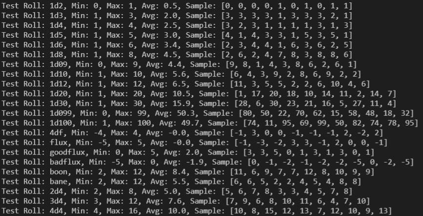

**What's New with PyDiceroll 3.4?**
===================================

New for PyDiceroll 3.4.0
------------------------

The **MINMAXAVG** roll has been added. Just doing ``roll('MINMAXAVG')`` will output the Min, Max, and Averages for various
rolls. Mostly for testing. Nothing is returned from this roll. So print or variable assignment is not needed.

New for PyDiceroll 3.3.1
------------------------

Fixed error if non-numbers are entered.

New for PyDiceroll 3.3.0
------------------------

Input errors for ``roll()`` will now return a value of -9999 instead of 0.

New in PyDiceroll 3.2.1
-----------------------

New **D44** and **D88** rolls have been added. These are table rolls, similar to the **D66** roll.

Parsing
-------

The roll() function has improved parsing that allows for spaces from other program sources. Error-checking understands this
and will even check for negative numbers of dice. This improved feature works whether **PyDiceroll** is being used in a Python
program or at a CMD prompt.

Refactored for Python 3.9
-------------------------

**PyDiceroll's** code has been updated from 2.5 to 3.9 standards.

The **D5** Die
--------------

The **D5** has been added to **PyDiceroll**. It is basically a **D10** divided by 2, much like how the **D3** die is a **D6** that is divided by 2.
